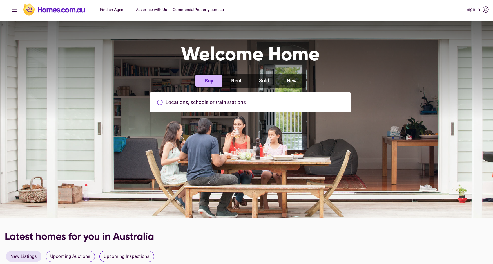

<!-- Main -->

<!-- One -->
<!-- 
<section id="one">
	

		<header class="major">
			<h2>The University of Melbourne</h2>
			<a href="" class="button icon fa-github">github</a>
		</header>
		

	

</section>
-->

<!-- Two -->
<section id="two" class="spotlights">
	<section>
		
		

			

				<header class="major">
					<h3>Senior Data Scientist @ Homes.com.au</h3>
					<h5>Jan 2021 - Present. Melbourne, Australia</h5>
				</header>
				

				My role supports the user engagement through AI and data capabilities to improve the search experience and personalisation in the form of data and ML end-to-end products, from acquiring the raw data, build data pipelines to ingest into a data lake and build ML pipelines for train and inference using CICD and IaC terraform to meet Engineering best practices.
				I am also a contributor to build the data science practice, mentor junior data scientists and collaborate with product and engineering stakeholders with the following achievements:  
				<ul>
				<li>Implemented a RAG (Retrieval Augmented Generation) across thousands of daily real estate listings increasing coverage by 25% using LLM Anthropic Claude (AWS Bedrock) and guardrails.</li>
				<li>Implemented multi-modal content-based recsys based on users’ shortlisted real estate listings achieving a 0.78(precision@5) utilising PyTorch and NVIDIA frameworks for GPU optimisations.</li>
				<li>Implemented multi-modal algorithms to extract concepts from text, images and spatial data to be used in downstream tasks.</li>
				<li>Implemented algorithms to rank listing images for a personalised UX achieving 0.89(precision@1). </li>
				<li>Productionized ML models to be consumed as APIs or batch operations aligned to data and engineering practices like Infra as code, containerization, model governance, big data processing, online/offline inference.</li>
				<li>Designed and implemented AWS SageMaker ML pipelines that enables MLOps through experimentation, model artifacts governance and deployment.</li>
				<li>Built vector embeddings representations that support multimodal search and recommendations representing items and user interaction profiles while communicating business value to internal stakeholders through clustering and visualisation techniques.</li>
				<li>Designed and implemented data pipelines with Airflow, Dagster and AWS Data Lake storage to generate clean and curated datasets for analytics and machine learning Implemented big data transformations and data catalog with pyspark, SQL and DBT models</li>
				</ul>
				

				<ul class="actions">
                    
				</ul>
			

		

	</section>

	<section>
		
		

			

				<header class="major">
					<h3>Data Scientist | Advanced APP Engineering Specialist @ Accenture</h3>
					<h5>Sept 2019 - Dec 2020. Melbourne, Australia</h5>
				</header>
				

				myWizard AiOps team develops applications that leverage machine learning automation capabilities to optimise process efficiency productivity.
				myWizard® is a non-disruptive, open architecture, cloud-based platform, powered by analytics and artificial intelligence that drives automation at scale.
				What I have acomplished: 
				<ul>
				<li>Developed machine learning model experiments for projects’ early cost prediction.</li>
				<li>Developed machine learning pipeline framework using <a href="https://mlflow.org/">MLFlow</a> to track models and deploy to docker containers / generate artifacts for tensorflow js.</li>
				<li>Implemented Natural Language Processing Deep Learning model to extract entities from user feedback.</li>
				<li>Implemented a data pipeline with Apache Airflow.</li>
				<li>Implemented data visualization dashboards with Apache Superset.</li>
				<li>Developed data model and python flask REST API backend for Estimator app to estimate project cost.</li>
				<li>Elaborated a proof of concept to integrate myWizard Automatic Ticket Resolver (ATR) with Digital Desk chatbot.</li>
				</ul>
				

				<ul class="actions">
                    
					<li><a href="https://www.accenture.com/hu-en/services/applied-intelligence/mywizard-intelligent-automation-platform" class="button">Learn more</a></li>
				</ul>
			

		

	</section>

	<section>

		

			

				<header class="major">
					<h3>Data Specialist @ Freelance</h3>
					<h5>Freelance</h5>
					<h5>Apr 2020 - Present. Los Angeles, USA</h5>
				</header>
				

				Implemented consultancy work in Latin America, US and Europe for projects involving:  
				<ul>
				<li>ML on audio data to implement voice-based interactions</li>
				<li>Data pipelines and ML for time series forecasting</li>
				<li>Data pipelines and data governance consultancy projects</li>
				</ul>
				

				<ul class="actions">
                    
				</ul>
			

		

	</section>
	<section>
		
		

			

				<header class="major">
					<h3>Data Scientist (Capstone Project with Unimelb) @ Seek</h3>
					<h5>Mar 2019 - Nov 2019. Melbourne, Australia</h5>
				</header>
				

				Smart Orders prediction
				What I have acomplished: 
				<ul>
				<li>Implemented Natural Language Processing Deep Learning model to extract entities from Job Ads (Named Entity Recognition)</li>
				<li>Trained and evaluated a Language Model for contextual word embeddings in 500K jobs ads.</li>
				<li>Evaluated pre-trained word embeddings performance like BERT and GPT-2</li>
				<li>Performed Exploratory Data Analysis for 500K+ job ads</li>
				<li>Developed sampling data strategy and performed data cleaning and annotation tasks</li>

				</ul>
				

				<ul class="actions">
                    
				</ul>
			

		

	</section>

    <section>
		
		

			

				<header class="major">
					<h3>Research Community Coordinator @ The University of Melbourne</h3>
					<h5>Apr 2020 - Present. Los Angeles, USA</h5>
				</header>
				
As a community coordinator, I help to train researchers in emerging digital tools to work smarter in research data analysis, collection and visualisation. The aim of a “Research Community Coordinator” is to engage a community of cross-disciplinary researchers in the use of these skills, specifically in Python programming language for Natural Language Processing.
				What I have acomplished: 
				<ul>
				<li>Led a community at Research Computing Services with 150+ graduate researchers helping to analyze large text datasets using python and natural language processing.</li>
				<li>Conducted workshops, trainings and meetups to discuss natural language processing </li>
				<li>Developed multimedia content to engage the research community.</li>

				</ul>
				

				<ul class="actions">
                    
                    
					<li><a href="https://research.unimelb.edu.au/infrastructure/research-platform-services/training/nltk" class="button">Learn more</a></li>
				</ul>
			

		

	</section>
	<section>
		
		

			

				<header class="major">
					<h3>Senior Business Analyst & Product Manager @ Globant</h3>
				</header>
				

				Globant <b>(NYSE: GLOB)</b> is an IT and Software Development company operating in Argentina, Colombia,
				Uruguay, the United Kingdom, Brazil, the United States, Peru, India, Mexico, Chile and Spain
                What I have acomplished: 
				<ul>
                <li>Led product definition with a distributed development team across Latin America and Spain for Mortgages and Loans at the OpenBank, the digital bank of Santander Group.</li>
				<li>Maintained a roadmap and backlog with Client stakeholders.</li>
				<li>Supported Jhonson & Jhonson Salesforce.com new internal features for Europe and Asia - Pacific (APAC).</li>
				<li>Led the Offshore Business Analyst team for Southwest.com with development teams across the United States and Latin America.</li>
				<li>Analyzed different data sources to maintain a defect backlog to prioritize the work of 20+ developers.</li>
				</ul>
				

				<ul class="actions">
                    
					<li><a href="https://www.globant.com" class="button">Learn more</a></li>
				</ul>
			

		

	</section>

	<section>
		
		

			

				<header class="major">
					<h3>Lead Software Architect @ Innobile</h3>
				</header>
				

				Innobile develop data capture automation solutions using identification technologies like RFID (Radio-Frecuency Identification) and mobile computing to enable scalable data-driven processes in the cloud.
                <ul>
                <li>Designed and developed the first on-cloud RFID enabled Warehouse Management System and inventory tracking built in Colombia introducing Software as a Service model.</li>
				<li>Implemented components in Amazon Web Services (AWS) with JavaEE, Android and .NET Mobile architecture.</li>
				<li>Led more than 20 projects for data capture automation for medium-large size companies and government agencies (Department of Defense).</li>
				<li>Developed a partnership with  Zebra Technologies, local vendors and delivered company investors pitch, San Francisco, USA</li>
				</ul>
                

				<ul class="actions">
                    
					<li><a href="http://innobile.com" class="button">Learn more</a></li>
				</ul>
			

		

	</section>
	<section>
		
		

			

				<header class="major">
					<h3>IT Manager @ Ragged</h3>
				</header>
				

                Ragged is in the top 50 retail stores in Colombia. As an IT Manager I was responsible of leading the technology strategy across all organisation.
                 
                <ul>
                <li>Led the Information Technology Strategic Plan and Execution Project (PETI) across 15 user leaders from all departments in the company.</li>
				<li>Performed Data Analysis and Business Process Analysis for the ERP Microsoft Dynamics AX implementation with Fashion & Textile Vertical.</li>
				<li>Implemented  more than 7 additional technology projects to support business operations</li>
				<li>Implemented ITIL v3 for service improvement and COBIT (IT Governance)</li>
                </ul>
                

				<ul class="actions">
                    
					<li><a href="http://www.ragged.com.co" class="button">Learn more</a></li>
				</ul>
			

		

	</section>
</section>

<!-- Three -->
<!--
<section id="three">
	

		<header class="major">
			<h2>Massa libero</h2>
		</header>
		
Nullam et orci eu lorem consequat tincidunt vivamus et sagittis libero. Mauris aliquet magna magna sed nunc rhoncus pharetra. Pellentesque condimentum sem. In efficitur ligula tate urna. Maecenas laoreet massa vel lacinia pellentesque lorem ipsum dolor. Nullam et orci eu lorem consequat tincidunt. Vivamus et sagittis libero. Mauris aliquet magna magna sed nunc rhoncus amet pharetra et feugiat tempus.

		<ul class="actions">
			<li><a href="generic.html" class="button next">Get Started</a></li>
		</ul>
	

</section>
-->

