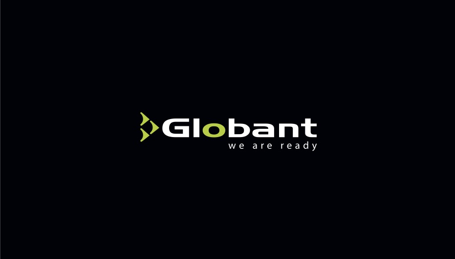
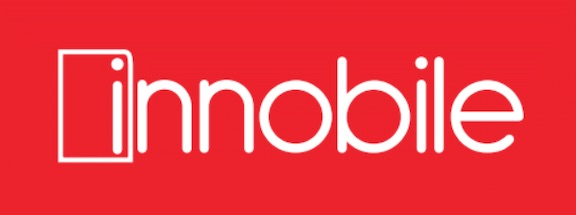

<!-- Main -->

<!-- One -->
<!-- 
<section id="one">
	

		<header class="major">
			<h2>The University of Melbourne</h2>
			<a href="" class="button icon fa-github">github</a>
		</header>
		

	

</section>
-->

<!-- Two -->
<section id="two" class="spotlights">
    <section>
		
		

			

				<header class="major">
					<h3><b>Research Community Coordinator</b>, The University of Melbourne</h3>
				</header>
				
As a community coordinator, I help to train researchers in emerging digital tools to work smarter in research data analysis, collection and visualisation. The aim of a “Research Community Coordinator” is to engage a community of cross-disciplinary researchers in the use of these skills, specifically in Python programming language for Natural Language Processing.

				<ul class="actions">
                    
                    
					<li><a href="https://research.unimelb.edu.au/infrastructure/research-platform-services/training/nltk" class="button">Learn more</a></li>
				</ul>
			

		

	</section>
	<section>
		
		

			

				<header class="major">
					<h3>Globant</h3>
				</header>
				

                <ul>
                <li><a href="https://www.openbank.es/en" >Openbank</a>: product analysis and delivery for mortgages, loans and insurance products.
                Openbank is the digital bank from Santander Group in Spain. Globant teams built from scratch the new digital platform, an entire online banking. My teams were responsible of Mortgages product which led to an important revenue increase. We also launch loans products and started the definition to build an insurance suite to launch on 2018.</li>
                <li>Support <a href="https://www.salesforce.com/au/?ir=1" >Jhonson&Jhonson salesforce.com</a> new internal features for Europe and Asia-Pacific.</li>
                <li><a href="https://www.southwest.com" >Southwest Airlines</a>: support of system redesign to implement international operations outside the United States using integration with Amadeus system. My team was responsible for the delivery of the new southwest.com, the biggest low cost airline e- commerce website in the US.</li>
                </ul>
                 
                As part of my role I collaborate with my teams which were distributed across the US, Latin America, Spain and India.
                

				<ul class="actions">
                    
					<li><a href="https://www.globant.com" class="button">Learn more</a></li>
				</ul>
			

		

	</section>
	<section>
		
		

			

				<header class="major">
					<h3>Innobile</h3>
				</header>
				

                <ul>
                <li>Lead software design and architecture for the first on-cloud RFID enabled Warehouse Management System and inventory tracking built in Colombia introducing SAAS model.</li>
                <li>Lead more than 20 projects for data capture automation for medium-large size companies and government agencies (Department of Defense)</li>
                </ul>
                

				<ul class="actions">
                    
					<li><a href="http://innobile.com" class="button">Learn more</a></li>
				</ul>
			

		

	</section>
	<section>
		
		

			

				<header class="major">
					<h3>Ragged & Phax</h3>
				</header>
				

                Ragged is in the top 50 retail stores in Colombia. As an IT Manager I was responsible of leading the technology strategy across all organisation.
                 
                <ul>
                <li>I Lead the Information Technology Strategic Plan and Execution Project (PETI) across 15 user leaders from all departments in the company.</li>
                <li>I executed Business Process Analysis and Project Management for the ERP Microsoft Dynamics AX implementation with Textile Vertical.</li>
                <li>I managed more than 7 additional technology projects to support business operations</li>
                <li>Performed ITIL v3 implementation for service improvement and COBIT (IT Governance)</li>
                </ul>
                

				<ul class="actions">
                    
					<li><a href="http://www.ragged.com.co" class="button">Learn more</a></li>
				</ul>
			

		

	</section>
</section>

<!-- Three -->
<!--
<section id="three">
	

		<header class="major">
			<h2>Massa libero</h2>
		</header>
		
Nullam et orci eu lorem consequat tincidunt vivamus et sagittis libero. Mauris aliquet magna magna sed nunc rhoncus pharetra. Pellentesque condimentum sem. In efficitur ligula tate urna. Maecenas laoreet massa vel lacinia pellentesque lorem ipsum dolor. Nullam et orci eu lorem consequat tincidunt. Vivamus et sagittis libero. Mauris aliquet magna magna sed nunc rhoncus amet pharetra et feugiat tempus.

		<ul class="actions">
			<li><a href="generic.html" class="button next">Get Started</a></li>
		</ul>
	

</section>
-->

