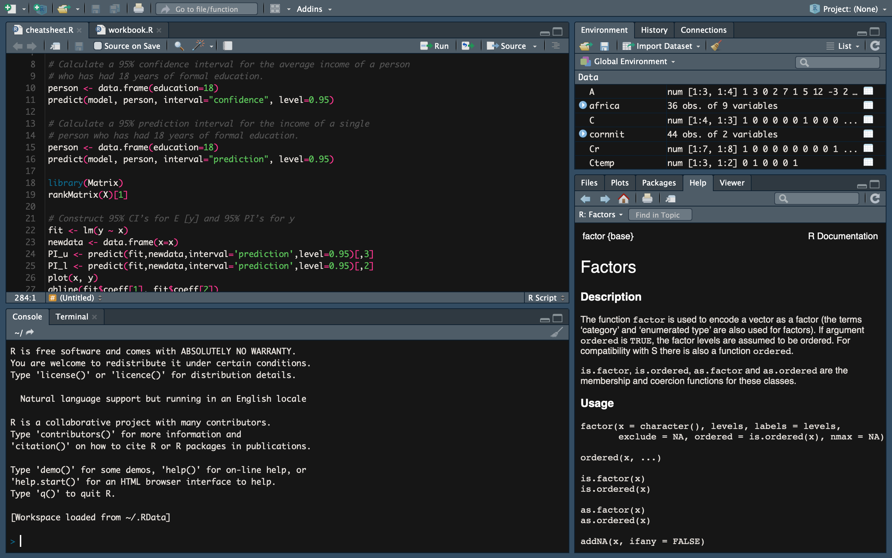
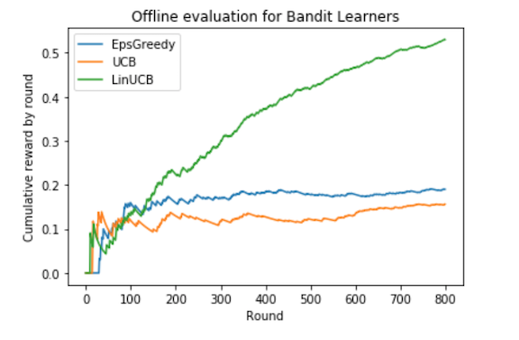

<!-- Main -->

<!-- One -->
<!-- 
<section id="one">
	

		<header class="major">
			<h2>Mathematical Statistics</h2>
			<a href="https://github.com/danielfelipegil/mathematical-statistics" class="button icon fa-github">github</a>
		</header>
		
Basic statistical concepts including maximum likelihood, sufficiency, unbiased estimation, confidence intervals, hypothesis testing and significance levels.

		
Estimation of model parameters, hypothesis testing using analysis of variance, model selection, diagnostics on model assumptions, and prediction considering computational techniques, including the EM algorithm, Bayes methods and Monte-Carlo methods.

	

</section>
-->

<!-- Two -->
<section id="two" class="spotlights">
	<section>
		
		

			

				<header class="major">
					<h3>Mathematical Statistics</h3>
				</header>
				
Basic statistical concepts including maximum likelihood, sufficiency, unbiased estimation, confidence intervals, hypothesis testing and significance levels.

				
Estimation of model parameters, hypothesis testing using analysis of variance, model selection, diagnostics on model assumptions, and prediction considering computational techniques, including the EM algorithm, Bayes methods and Monte-Carlo methods.

				<ul class="actions">
					<a href="https://github.com/danielfelipegil/mathematical-statistics" class="button icon fa-github">github</a>
					<li><a href="https://danielfelipegil.github.io/mathematical-statistics/" class="button">Learn more</a></li>
				</ul>
			

		

	</section>
	<section>
		
		

			

				<header class="major">
					<h3>Machine Learning</h3>
				</header>
				
supervised learning, semi-supervised and active learning, unsupervised learning, kernel methods, probabilistic graphical models, classifier combination, neural networks.

				<ul class="actions">
					<a href="https://github.com/danielfelipegil/machine-learning" class="button icon fa-github">github</a>
					<li><a href="https://danielfelipegil.github.io/machine-learning/" class="button">Learn more</a></li>
				</ul>
			

		

	</section>
	<section>
		
		

			

				<header class="major">
					<h3>Artificial Intelligence (AI)</h3>
				</header>
				
Developing autonomous agents: active entities that perceive their environment, reason, plan and execute appropriate actions to achieve their goals, in service of their users (the real world, human beings, or other agents)

				

				Related topics: Reinforcement Learning; Game Theory; Search algorithms and heuristic functions; Classical (AI), probabilistic and non-deterministic planning.
				

				<ul class="actions">
					<a href="https://github.com/danielfelipegil/artificial-intelligence" class="button icon fa-github">github</a>
					<li><a href="https://danielfelipegil.github.io/artificial-intelligence/" class="button">Learn more</a></li>
				</ul>
			

		

	</section>
	<section>
		
		

			

				<header class="major">
					<h3>Natural Language Processing</h3>
				</header>
				
Related topics:Text classification algorithms such as logistic regression; Vector space models for natural language semantics; Structured prediction, Hidden Markov models; N-gram language modelling, including statistical estimation;Alignment of parallel corpora, Term indexing, term weighting for information retrieval; Query expansion and relevance feedback

				<ul class="actions">
					<a href="https://github.com/danielfelipegil/web-search-text-analysis" class="button icon fa-github">github</a>
					<li><a href="https://danielfelipegil.github.io/web-search-text-analysis/" class="button">Learn more</a></li>
				</ul>
			

		

	</section>
</section>

<!-- Three -->
<!--
<section id="three">
	

		<header class="major">
			<h2>Massa libero</h2>
		</header>
		
Nullam et orci eu lorem consequat tincidunt vivamus et sagittis libero. Mauris aliquet magna magna sed nunc rhoncus pharetra. Pellentesque condimentum sem. In efficitur ligula tate urna. Maecenas laoreet massa vel lacinia pellentesque lorem ipsum dolor. Nullam et orci eu lorem consequat tincidunt. Vivamus et sagittis libero. Mauris aliquet magna magna sed nunc rhoncus amet pharetra et feugiat tempus.

		<ul class="actions">
			<li><a href="generic.html" class="button next">Get Started</a></li>
		</ul>
	

</section>
-->

