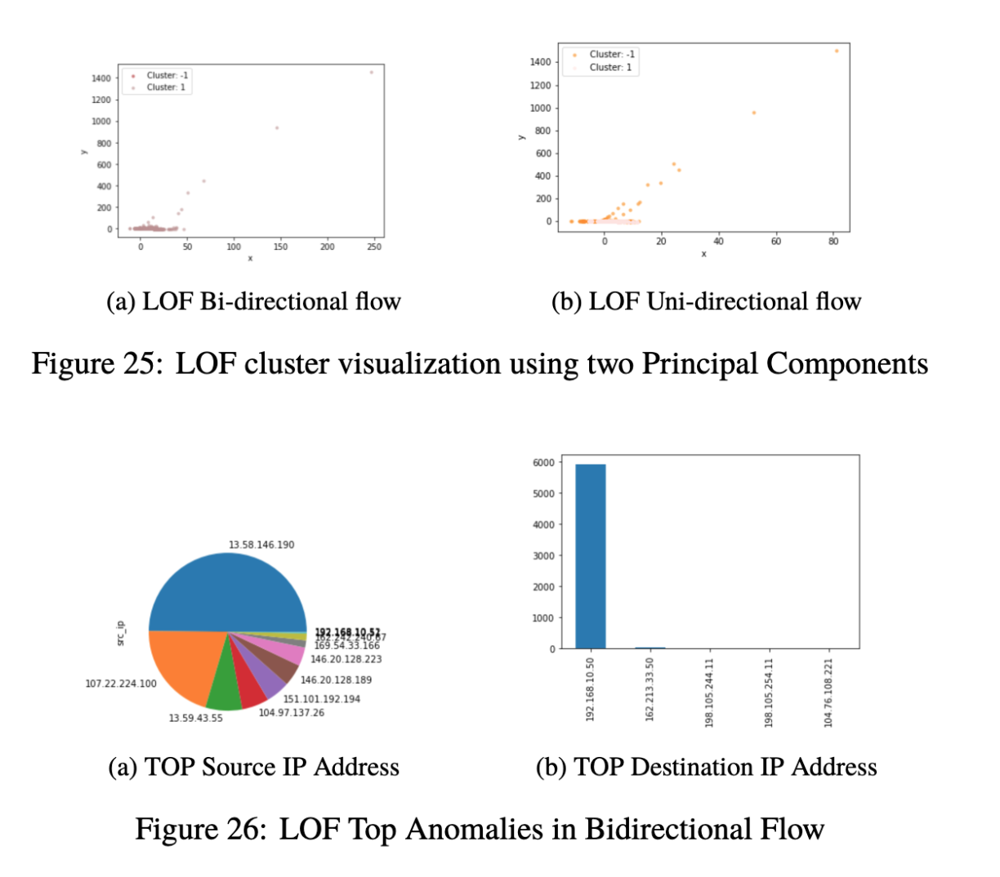
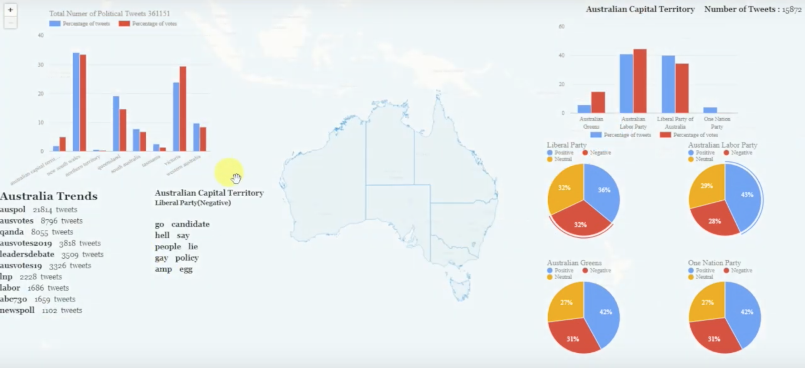

<!-- Main -->

<!-- One -->
<!-- 
<section id="one">
	

		<header class="major">
			<h2>Mathematical Statistics</h2>
			<a href="https://github.com/danielfelipegil/mathematical-statistics" class="button icon fa-github">github</a>
		</header>
		
Basic statistical concepts including maximum likelihood, sufficiency, unbiased estimation, confidence intervals, hypothesis testing and significance levels.

		
Estimation of model parameters, hypothesis testing using analysis of variance, model selection, diagnostics on model assumptions, and prediction considering computational techniques, including the EM algorithm, Bayes methods and Monte-Carlo methods.

	

</section>
-->

<!-- Two -->
<section id="two" class="spotlights">
	
	<section>
		
		

			

				<header class="major">
					<h3><b>SEEK Ltd</b>, Named Entity Recognition and extraction in Job Ads</h3>
				</header>
				

				Named Entity Recognition (NER) in Job Ads to extract company names, skills and requirements using contextual character-based word embeddings and BiLSTM-CRF Neural Networks.
				

				<ul class="actions">
					<li><a href="mailto:dfgilto@gmail.com" class="button">Learn more (Available on request)</a></li>
				</ul>
			

		

	</section>

	<section>
		
		

			

				<header class="major">
					<h3><b>Security Analytics</b>, Analytics & Machine learning for anomaly detection</h3>
				</header>
				

				Exploration of data sources that are relevant to detecting different types of security threats like operating system logs, web server logs, packet traces, flow records and deep packet inspection traces using <a href="https://www.splunk.com/">Splunk Analytics</a>. 
				These datasets are evaluated using methods from machine learning that are widely used for cyber security analysis. Specifically, unsupervised machine learning techniques for anomaly detection, alarm correlation and intrusion detection. 
				In addition, some theoretical challenges and emerging issues for security analytics research are explored like privacy‐preserving analytics, adversarial machine learning, concept drift and new applications in monitoring critical infrastructure.
				

				<ul class="actions">
					<a href="https://github.com/danielgil1/security_analytics" class="button icon fa-github">github</a>
					<li><a href="https://github.com/danielgil1/security_analytics/blob/master/SA_Assignment2_Report.pdf" class="button">Learn more</a></li>
				</ul>
			

		

	</section>

	<section>
		
		

			

				<header class="major">
					<h3><b>Social Media Analytics & Cloud Computing</b>, Scalable Machine Learning</h3>
				</header>
				

				Social Media Analytics application using Ansible automated scripts to deploy and scale in the cloud automatically a cluster of NoSql databases (CouchDB), queue services (RabbitMQ) and bots that crawl twitter feeds to perform sentiment analysis and political views summarized through map reduce plotted in a geospatial environment. 
				

				<ul class="actions">
					<a href="https://github.com/danielgil1/social_media_analytics" class="button icon fa-github">github</a>
					<li><a href="https://youtu.be/c0q4VXDYo1Q" class="button">Learn more</a></li>
				</ul>
			

		

	</section>

	<section>
		
		

			

				<header class="major">
					<h3><b>Ticket Intent Extraction</b>, Accenture Project X Bootcamp</h3>
				</header>
				

				Helpdesk ticket extraction using Unsupervised Learning (LDA Topic Model and K-Means), exploratory analysis and pre-processing using NLTK and visualizing results with pyLDAvis. A Jupyter Notebook is available to run models, a Flask API and Web App can be run separately or hosted on Splunk deployed through a Docker container.
				

				<ul class="actions">
					<a href="" class="button icon fa-github">github (Not Available due to confidentiality</a>
				</ul>
			

		

	</section>

	<section>
		
		

			

				<header class="major">
					<h3><b>Language Models and Conversational AI</b>, Presented at Research Bazar 2019, University of Melbourne</h3>
				</header>
				

				Voice interaction for a hangman game AI with Amazon Alexa device using Language Models 	and AWS Lambda Functions. 
				

				<ul class="actions">
					<a href="https://github.com/danielgil1/hangman-resbaz" class="button icon fa-github">github</a>
				</ul>
			

		

	</section>

	<section>
		
		

			

				<header class="major">
					<h3>Mathematical Statistics</h3>
				</header>
				
Basic statistical concepts including maximum likelihood, sufficiency, unbiased estimation, confidence intervals, hypothesis testing and significance levels.

				
Estimation of model parameters, hypothesis testing using analysis of variance, model selection, diagnostics on model assumptions, and prediction considering computational techniques, including the EM algorithm, Bayes methods and Monte-Carlo methods.

				<ul class="actions">
					<a href="https://github.com/danielgil1/mathematical-statistics" class="button icon fa-github">github</a>
					<li><a href="https://danielgil1.github.io/mathematical-statistics/" class="button">Learn more</a></li>
				</ul>
			

		

	</section>
	<section>
		
		

			

				<header class="major">
					<h3><b>Statistical Machine Learning</b>, Missing Links prediction in Social network & 	Multi-armed bandits for Ads Optimization</h3>
				</header>
				
Supervised learning, semi-supervised and active learning, unsupervised learning, kernel methods, probabilistic graphical models, classifier combination, neural networks.

				<ul class="actions">
					<a href="https://github.com/danielgil1/machine-learning" class="button icon fa-github">github</a>
					<li><a href="https://danielgil1.github.io/machine-learning/" class="button">Learn more</a></li>
				</ul>
			

		

	</section>
	<section>
		
		

			

				<header class="major">
					<h3><b>Artificial Intelligence</b>, Reinforcement Learning Agent for Pacman</h3>
				</header>
				
Developing autonomous agents: active entities that perceive their environment, reason, plan and execute appropriate actions to achieve their goals, in service of their users (the real world, human beings, or other agents)

				

				Related topics: Reinforcement Learning; Game Theory; Search algorithms and heuristic functions; Classical (AI), probabilistic and non-deterministic planning.
				

				<ul class="actions">
					<a href="https://github.com/danielgil1/artificial-intelligence" class="button icon fa-github">github</a>
					<li><a href="https://danielgil1.github.io/artificial-intelligence/" class="button">Learn more</a></li>
				</ul>
			

		

	</section>
	<section>
		
		

			

				<header class="major">
					<h3><b>Web search and Text Analysis (Natural Language Processing)</b>,Question - Answering System
</h3>
				</header>
				
Related topics:Text classification algorithms such as logistic regression; Vector space models for natural language semantics; Structured prediction, Hidden Markov models; N-gram language modelling, including statistical estimation;Alignment of parallel corpora, Term indexing, term weighting for information retrieval; Query expansion and relevance feedback

				<ul class="actions">
					<a href="https://github.com/danielgil1/web-search-text-analysis" class="button icon fa-github">github</a>
					<li><a href="https://danielgil1.github.io/web-search-text-analysis/" class="button">Learn more</a></li>
				</ul>
			

		

	</section>
</section>

<!-- Three -->
<!--
<section id="three">
	

		<header class="major">
			<h2>Massa libero</h2>
		</header>
		
Nullam et orci eu lorem consequat tincidunt vivamus et sagittis libero. Mauris aliquet magna magna sed nunc rhoncus pharetra. Pellentesque condimentum sem. In efficitur ligula tate urna. Maecenas laoreet massa vel lacinia pellentesque lorem ipsum dolor. Nullam et orci eu lorem consequat tincidunt. Vivamus et sagittis libero. Mauris aliquet magna magna sed nunc rhoncus amet pharetra et feugiat tempus.

		<ul class="actions">
			<li><a href="generic.html" class="button next">Get Started</a></li>
		</ul>
	

</section>
-->

